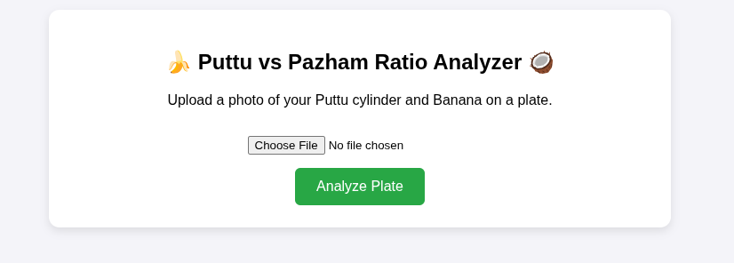
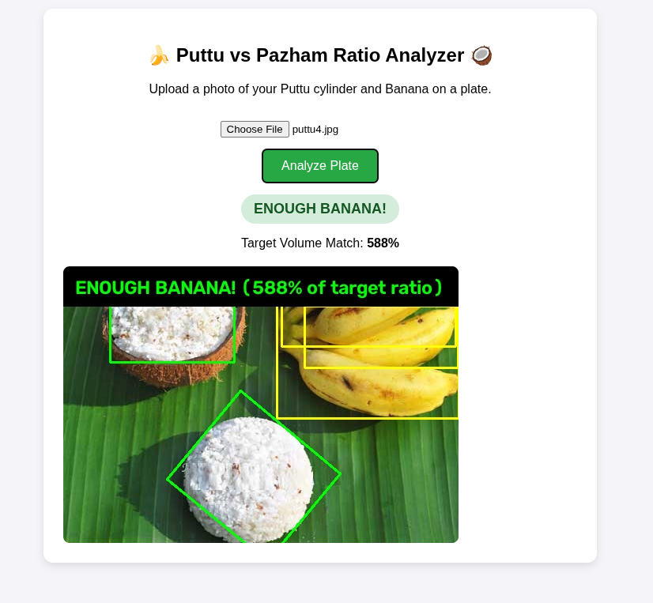
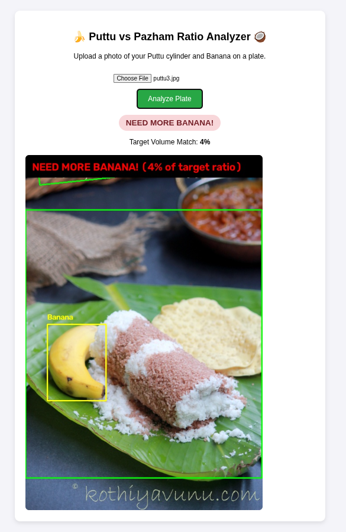

# Puttu-to-Pazham Analyzer 🍌🥥

## Basic Details
### Team Name: Mangaandi

### Team Members
- Member 1: Eshaan Abdulkalam - Govt. Model Engineering College 
- Member 2: Jenit Mariya -  Govt. Model Engineering College

### Project Description
An AI-powered computer vision web application that analyzes a photo of your breakfast plate to measure the volumetric ratio between a puttu cylinder and banana slices/whole bananas. It instantly tells you if you have enough banana to complete your puttu meal smoothly or if you need to go grab another one.

### The Problem (that doesn't exist)
The devastating tragedy of reaching the final bites of a hot puttu cylinder only to realize you ran out of banana 30 seconds ago, or the inverse panic of having a lone, orphaned piece of banana left with zero puttu to pair it with. Culinary geometry balance is too important to be left to uncalculated visual estimation.

### The Solution (that nobody asked for)
We combined deep learning and volumetric calculus to solve breakfast proportions! The app uses a pre-trained **YOLOv8** object detection model to isolate bananas and **OpenCV Otsu thresholding** to isolate the puttu cylinder. It calculates their pixel-volume estimates ($V_{\text{banana}} / V_{\text{puttu}}$) and checks if the ratio satisfies the golden ratio of Malayali breakfast ($\ge 0.35$).

---

## Technical Details

### Technologies/Components Used
For Software:
- **Languages:** Python 3.11+, JavaScript (ES6+), HTML5, CSS3
- **Frameworks:** FastAPI
- **Libraries:** OpenCV (`opencv-python-headless`), Ultralytics (`yolov8n`), PyTorch (CPU), NumPy
- **Tools / Deployment:** Uvicorn, Git, Render Free Web Service

---

### Implementation

#### Installation
```bash
# Clone the repository
git clone [https://github.com/Eshaanmanath/useless_project_pazham-indo](https://github.com/Eshaanmanath/useless_project_pazham-indo)
cd YOUR_REPO_NAME

# Create and activate virtual environment
python -m venv venv
source venv/bin/activate  # On Windows use: venv\Scripts\activate

# Install dependencies with CPU-optimized PyTorch
pip install --upgrade pip
pip install -r requirements.txt
```

#### Run
```bash
# Start the local development server
uvicorn app:app --reload

# Open your browser and navigate to: [http://127.0.0.1:8000](http://127.0.0.1:8000)
```

---

## Project Documentation

### Screenshots


*The web interface allowing users to upload or capture a plate photo.*


*YOLOv8 and OpenCV successfully segmenting the banana and puttu on a steel thali plate, confirming a target match.*


*The app issuing a 'NEED MORE BANANA!' warning banner when the volumetric ratio falls below 0.35.*

# Diagrams
```text
[ User Uploads Photo ] ──► [ Client-Side JS Downscaling (1024px) ]
                                      │
                                      ▼
                        [ FastAPI Backend (/analyze) ]
                                      │
             ┌────────────────────────┴────────────────────────┐
             ▼                                                 ▼
[ YOLOv8 Banana Detection ]                      [ OpenCV Grayscale Blur ]
(COCO Class 46 / Segmentation)                                 │
             │                                                 ▼
             │                                   [ Otsu Dynamic Thresholding ]
             │                                                 │
             └──────────────► [ Mask Subtraction ] ────────────┘
                                     │
                                     ▼
                        [ Contour Filter (>3000px) ]
                                     │
                                     ▼
                      [ Minimum Area Bounding Boxes ]
                                     │
                                     ▼
                   [ Volumetric Ratio Calc (V_b / V_p) ]
                                     │
                                     ▼
                     [ Render Result Image & Banner ]
```
*System architecture showing the hybrid computer vision processing pipeline.*

---

### Project Demo
# Video
[[Demo Video](https://drive.google.com/file/d/1TObXXRcgudQVBR-sEcSm9YkDXP5uN9XE/view?usp=sharing)]
*Video demonstrating real-time photo upload, server processing via YOLO + OpenCV, and dynamic UI feedback.*

# Additional Demos
- **Live Web App:** [https://useless-project-pazham-indo.onrender.com/](https://useless-project-pazham-indo.onrender.com/)

---


---
Made with ❤️ at TinkerHub Useless Projects 


